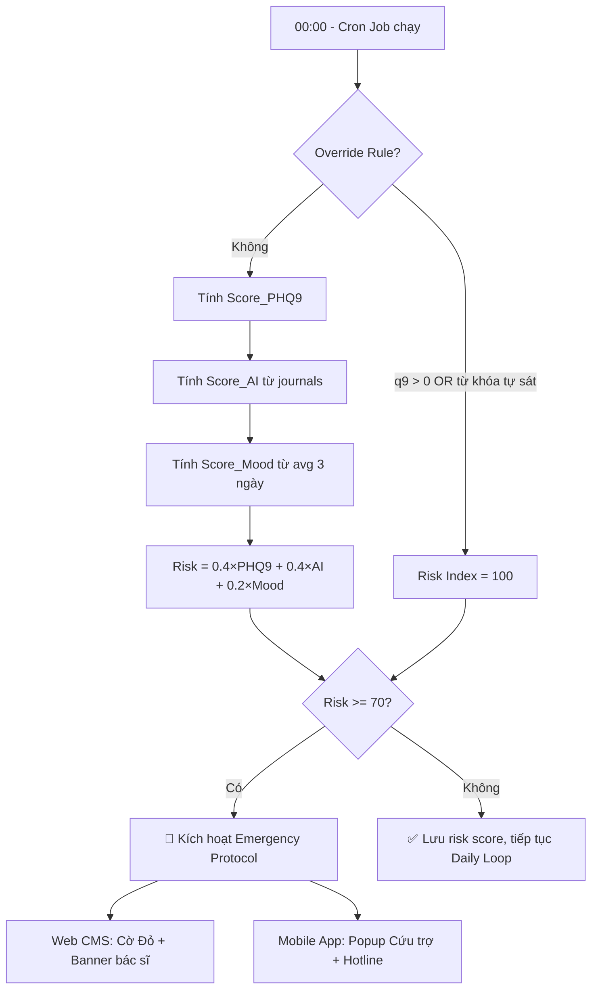

# THUẬT TOÁN ĐÁNH GIÁ RỦI RO NGẦM (RISK INDEX ALGORITHM)
**Tài liệu:** Đặc tả Kỹ thuật Backend – Re-Connect Platform  
**Module:** Background Jobs / Risk Scoring Engine  
**Phiên bản:** 2.0

---

## 1. TỔNG QUAN

Hệ thống tính **Risk Index** hoàn toàn ngầm ở Backend. Bệnh nhân **không bao giờ nhìn thấy** con số này. Chỉ bác sĩ mới thấy qua Web CMS dưới dạng biểu đồ xu hướng và cờ cảnh báo.

**Thời điểm chạy:** Cron Job chạy vào **00:00 mỗi đêm**, quét toàn bộ bệnh nhân đang Active.

---

## 2. CÔNG THỨC TỔNG HỢP

```
Risk_Index = (0.4 × Score_PHQ9) + (0.4 × Score_AI) + (0.2 × Score_Mood)
```

| Biến số | Trọng số | Nguồn dữ liệu |
|---|---|---|
| `Score_PHQ9` | 40% | Bảng `phq9_submissions` |
| `Score_AI` | 40% | Bảng `journals` (NLP bởi Gemini API) |
| `Score_Mood` | 20% | Bảng `user_moods` (Mood Check-in hàng ngày) |

> **Lưu ý quan trọng:** Công thức này **chỉ chạy sau khi** kiểm tra Override Rule ở Bước 4. Nếu Override Rule kích hoạt, bỏ qua hoàn toàn công thức.

---

## 3. CHI TIẾT TỪNG BIẾN SỐ

### 3.1 Biến số 1: Score_PHQ9 (Trọng số 40%)

Hệ thống **không dùng tổng điểm PHQ-9** mà chỉ quét các câu hỏi biểu thị sự nguy hiểm cụ thể:

| Điều kiện | Score_PHQ9 |
|---|---|
| `q9_score` (Câu 9 – Ý định tự hại) = 1, 2, hoặc 3 | **100 điểm** |
| `q9_score` = 0 **VÀ** `q2_score` (Câu 2 – Tuyệt vọng) = 3 | **70 điểm** |
| Tất cả trường hợp còn lại | **0 điểm** |

> **Câu 9 PHQ-9:** "Có ý nghĩ rằng tốt hơn là nên chết đi hoặc muốn tự làm đau bản thân theo cách nào đó?"  
> **Câu 2 PHQ-9:** "Cảm thấy buồn bã, chán nản hoặc tuyệt vọng?"

**Mapping cột DB:** `phq9_submissions.q9_score` và `phq9_submissions.q2_score`

---

### 3.2 Biến số 2: Score_AI (Trọng số 40%)

AI (Google Gemini) được thiết lập **System Prompt** phân loại ngôn ngữ tự nhiên từ nhật ký:

#### Mức 100 – Rủi ro Tính mạng (Life Threat)
Ngôn ngữ chứa từ khóa liên quan đến **tự sát / kết thúc sinh mạng**:
- "muốn kết thúc tất cả"
- "không đáng sống"
- "muốn biến mất mãi mãi"
- "nhảy xuống", "uống thuốc hết đi"
- Bất kỳ cụm từ nào ám chỉ lên kế hoạch tự hại

#### Mức 70 – Kích hoạt Niềm tin Cốt lõi Tiêu cực (Core Belief Activation)
Ngôn ngữ biểu thị các **Niềm tin cốt lõi tiêu cực** (theo mô hình Jeffrey Young):

| Nhóm Niềm tin | Từ khóa nhận diện |
|---|---|
| **Bất lực (Helplessness)** | "Kẻ thua cuộc", "Mất kiểm soát", "Bị mắc kẹt", "Vô dụng", "Không làm được gì" |
| **Không thể yêu thương (Unlovability)** | "Bị bỏ rơi", "Cô độc mãi mãi", "Đáng ghét", "Không ai cần tôi" |
| **Vô giá trị (Worthlessness)** | "Rác rưởi", "Đồ bỏ đi", "Tốt hơn không có mặt trên đời", "Không xứng đáng" |

#### Mức 0 – Tiêu cực Thông thường (Situational Negativity)
Ngôn ngữ tiêu cực **gắn với tình huống cụ thể**, không phải bản sắc:
- "Bài tập hôm nay khó quá"
- "Bạn không reply tin nhắn của mình"
- "Bị kẹt xe, mệt mỏi"

**Mapping cột DB:** `journals.ai_risk_score` (lưu riêng) + `journals.risk_index` (tổng hợp)

---

### 3.3 Biến số 3: Score_Mood (Trọng số 20%)

Tính **trung bình cộng** điểm Mood Check-in của **3 ngày liên tiếp gần nhất**:

```
avg_mood = AVERAGE(user_moods.mood_score, 3 ngày gần nhất)
```

| Kết quả trung bình | Score_Mood |
|---|---|
| `avg_mood < 20%` | **100 điểm** – Chạm đáy, bế tắc hành vi hoàn toàn |
| `avg_mood >= 20%` và `< 35%` | **50 điểm** – Xu hướng tụt dốc nguy hiểm |
| `avg_mood >= 35%` | **0 điểm** – Trong ngưỡng bình thường |

> Nếu bệnh nhân **không check-in** trong 3 ngày liên tiếp → Mặc định coi `avg_mood = 0%` → Score_Mood = 100 điểm (dấu hiệu nguy hiểm từ sự im lặng).

**Mapping cột DB:** `user_moods.mood_score`, lọc theo `recorded_at DESC LIMIT 3`

---

## 4. QUY TẮC GHI ĐÈ KHẨN CẤP (OVERRIDE RULE)

> **Ưu tiên tuyệt đối: Bảo vệ tính mạng trước, tính toán sau.**

Khối logic này được **kiểm tra đầu tiên**, trước công thức trọng số:

```java
// Pseudocode – Risk Scoring Service
public int calculateRiskIndex(UUID patientId) {

    // BƯỚC 1: OVERRIDE RULE – Kiểm tra tín hiệu nguy hiểm tính mạng
    int q9Score = phq9Repository.getLatestQ9Score(patientId);
    boolean hasLifeThreatKeyword = journalRepository.hasLifeThreatKeyword(patientId, today);

    if (q9Score > 0 || hasLifeThreatKeyword) {
        return 100; // Bỏ qua công thức, trả về mức tối đa ngay lập tức
    }

    // BƯỚC 2: TÍNH CÔNG THỨC TRỌNG SỐ (chỉ chạy nếu Override không kích hoạt)
    int scorePHQ9  = calculatePHQ9Score(patientId);   // 0 / 70 / 100
    int scoreAI    = calculateAIScore(patientId);     // 0 / 70 / 100
    int scoreMood  = calculateMoodScore(patientId);   // 0 / 50 / 100

    double riskIndex = (0.4 * scorePHQ9) + (0.4 * scoreAI) + (0.2 * scoreMood);

    return (int) Math.round(riskIndex);
}
```

---

## 5. KỊCH BẢN RẼ NHÁNH SAU KHI CÓ RISK INDEX

### Trường hợp AN TOÀN (Risk Index < 70)

| Hệ thống | Hành động |
|---|---|
| **Web CMS (Bác sĩ)** | Hiển thị biểu đồ xu hướng bình thường |
| **Mobile App** | AI tiếp tục dẫn dắt Daily Loop bình thường |
| **Database** | Lưu `patient_profiles.current_risk_score` = giá trị mới |

### Trường hợp KHẨN CẤP (Risk Index >= 70)

| Hệ thống | Hành động |
|---|---|
| **Web CMS (Bác sĩ)** | Gắn Cờ Đỏ (🚨) vào bệnh nhân; đẩy lên đầu Roster; Banner nhấp nháy; mở nút "Gửi yêu cầu Can thiệp" |
| **Mobile App** | Ngưng giao task thông thường; hiển thị Popup Giao thức Cứu trợ kèm nút Telehealth + Hotline |
| **Database** | Lưu `journals.severity_level = 'DANGER'`; tạo bản ghi alert logic (hoặc flag trên `patient_profiles`) |

---

## 6. SƠ ĐỒ LUỒNG TỔNG HỢP



---

## 7. CÁC CỘT DATABASE LIÊN QUAN

### Bảng `phq9_submissions` (thêm mới)
```sql
ALTER TABLE phq9_submissions
ADD COLUMN q9_score  TINYINT NOT NULL DEFAULT 0 COMMENT 'Điểm câu 9: Ý định tự hại (0-3)',
ADD COLUMN q2_score  TINYINT NOT NULL DEFAULT 0 COMMENT 'Điểm câu 2: Tuyệt vọng (0-3)',
ADD COLUMN unlocked_at TIMESTAMP NULL COMMENT 'Thời điểm mở khóa bài test tiếp theo (cooldown 14 ngày)';
```

### Bảng `user_moods` (thêm mới hoàn toàn)
```sql
CREATE TABLE user_moods (
    id          CHAR(36)   PRIMARY KEY,
    patient_id  CHAR(36)   NOT NULL,
    mood_score  TINYINT    NOT NULL CHECK (mood_score BETWEEN 0 AND 100),
    recorded_at TIMESTAMP  NOT NULL DEFAULT CURRENT_TIMESTAMP,
    FOREIGN KEY (patient_id) REFERENCES patient_profiles(user_id)
);
```

### Bảng `journals` (thêm cột)
```sql
ALTER TABLE journals
ADD COLUMN ai_risk_score INT DEFAULT 0 COMMENT 'Điểm riêng từ AI NLP (0/70/100)';
```

### Bảng `patient_quests` (thêm cột)
```sql
ALTER TABLE patient_quests
ADD COLUMN mastery_score  TINYINT NULL COMMENT 'Điểm Thành tựu sau hoàn thành (0-10)',
ADD COLUMN pleasure_score TINYINT NULL COMMENT 'Điểm Niềm vui sau hoàn thành (0-10)';
```
