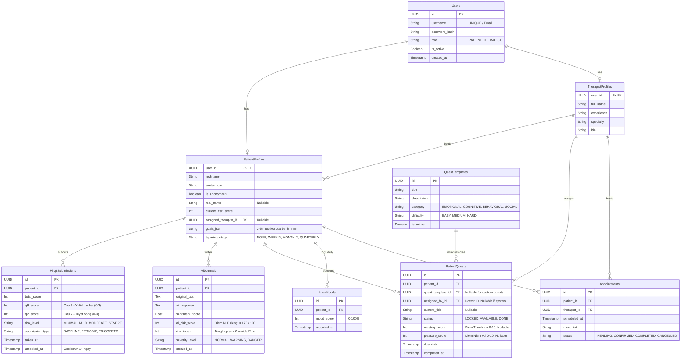
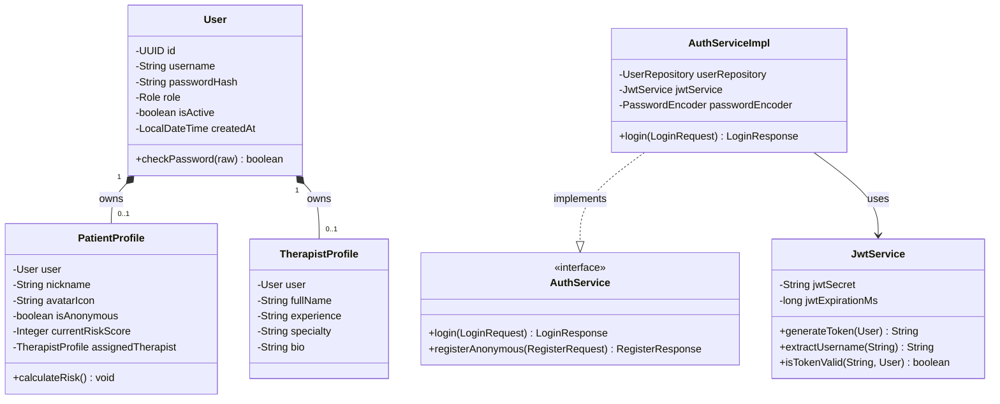

# MVP Database Schema

## 1. Muc tieu

Tai lieu nay rut gon ERD cua he thong MindHealth theo huong MVP, chi giu lai cac bang can thiet de trien khai luong chinh:

`Patient dang nhap -> lam PHQ-9 -> viet journal -> AI tinh risk -> mo quest -> Therapist xem risk chart -> giao them quest`

Muc tieu la:

- Giam so bang de de code va test
- Van bao toan duoc nghiep vu cot loi
- Phu hop voi scope do an ca nhan
- De dua vao bao cao va de giai thich khi bao ve

## 2. Nguyen tac rut gon

- Chi luu du lieu goc, khong luu qua nhieu bang trung gian
- Cac du lieu co the suy ra tu bang khac thi chua tach bang rieng
- Roadmap duoc suy ra tu `patient_quests`, chua can bang `roadmaps`
- Risk chart doc truc tiep tu `journals`, chua can `sentiment_logs`
- Emergency alert la logic nghiep vu, chua can bang `emergency_alerts`
- PHQ-9 luu 9 cau tra loi trong 1 cot JSON de tranh phat sinh bang `phq9_answers`

## 3. Pham vi schema MVP

### 3.1 Bang bat buoc

1. `users`
2. `patient_profiles`
3. `therapist_profiles`
4. `phq9_submissions`
5. `journals`
6. `quest_templates`
7. `patient_quests`
8. `user_moods` *(thêm lại – cần thiết cho Mood Check-in hàng ngày và thuật toán Risk Index)*

### 3.2 Bang de mo rong giai doan sau

1. `time_slots`
2. `appointments`

## 4. Ghi chu kieu khoa chinh

De dong bo voi backend hien tai, schema MVP dung `UUID` lam khoa chinh.

Trong MySQL, de de debug va viet bao cao, co the luu UUID duoi dang `CHAR(36)`.
Neu sau nay toi uu hieu nang, co the doi sang `BINARY(16)`.

## 5. ERD rut gon

## 6. Sơ đồ mô hình Lớp (Class Diagram - Auth Module)

## 6. Mo ta chi tiet tung bang

### 6.1 Bang `users`

Bang `users` chi luu thong tin xac thuc va phan quyen dung chung cho moi vai tro.

| Ten cot | Kieu du lieu | Rang buoc | Mo ta |
| --- | --- | --- | --- |
| id | char(36) | PK | UUID cua nguoi dung |
| username | varchar(150) | unique, not null | Dinh danh dang nhap; voi Therapist/Admin co the dung email, voi Patient co the la ma an danh |
| password_hash | varchar(255) | not null | Mat khau da ma hoa BCrypt |
| role | varchar(20) | not null | `PATIENT`, `THERAPIST`, `ADMIN` |
| is_active | boolean | default true | Trang thai hoat dong |
| created_at | timestamp | not null | Thoi gian tao tai khoan |

Ghi chu:

- Khong nen de `nickname`, `avatar_url` trong bang nay vi do la thong tin rieng cua Patient.
- Backend hien tai dang co [User.java](/d:/DOAN/reconnect_backend/src/main/java/com/reconnect/platform/entity/User.java); can thong nhat giua `email` va `username`.

### 6.2 Bang `patient_profiles`

Bang nay luu thong tin nghiep vu rieng cua Patient.

| Ten cot | Kieu du lieu | Rang buoc | Mo ta |
| --- | --- | --- | --- |
| user_id | char(36) | PK, FK -> users.id | Khoa chinh dong thoi la khoa ngoai den `users` |
| nickname | varchar(100) | unique, not null | Ten an danh hien thi tren app |
| avatar_icon | varchar(100) | not null | Ma avatar hoac duong dan asset |
| real_name | varchar(100) | null | Ten that neu nguoi dung muon chia se |
| is_anonymous | boolean | default true | Co che an danh |
| therapist_id | char(36) | FK -> therapist_profiles.user_id, null | Therapist dang theo doi Patient |
| streak_days | int | default 0 | So ngay duy tri thoi quen |
| goals_json | text | null | 3-5 muc tieu ca nhan chon luc Onboarding (luu dang JSON array) |
| tapering_stage | varchar(20) | default 'NONE' | Giai doan gian cach: NONE, WEEKLY, MONTHLY, QUARTERLY |

Ghi chu:

- Bang nay phu hop voi [PatientProfile.java](/d:/DOAN/reconnect_backend/src/main/java/com/reconnect/platform/entity/PatientProfile.java).
- `therapist_id` giup therapist xem danh sach patient dang quan ly.

### 6.3 Bang `therapist_profiles`

Bang nay luu thong tin rieng cua Therapist.

| Ten cot | Kieu du lieu | Rang buoc | Mo ta |
| --- | --- | --- | --- |
| user_id | char(36) | PK, FK -> users.id | Khoa chinh dong thoi la khoa ngoai den `users` |
| full_name | varchar(150) | not null | Ho ten therapist |
| bio | text | null | Gioi thieu ngan |
| specialty | varchar(100) | null | Chuyen mon |
| certificate_url | varchar(255) | null | File/url chung chi nghe nghiep |
| approval_status | varchar(20) | not null | `PENDING`, `ACTIVE`, `REJECTED` |
| created_at | timestamp | not null | Thoi gian tao profile |

Ghi chu:

- Bang nay phu hop voi [TherapistProfile.java](/d:/DOAN/reconnect_backend/src/main/java/com/reconnect/platform/entity/TherapistProfile.java).
- Neu chua muon lam duyet bac si ngay, co the default `ACTIVE` de demo.

### 6.4 Bang `phq9_submissions`

Bang nay luu ket qua bai test PHQ-9.

| Ten cot | Kieu du lieu | Rang buoc | Mo ta |
| --- | --- | --- | --- |
| id | char(36) | PK | UUID cua lan nop bai |
| patient_id | char(36) | FK -> patient_profiles.user_id, not null | Patient thuc hien bai test |
| answers_json | text | not null | 9 cau tra loi luu dang JSON |
| total_score | int | not null | Tong diem PHQ-9 |
| q9_score | tinyint | not null, default 0 | Diem cau 9 rieng le (0-3) – dung cho Override Rule cua Risk Index |
| q2_score | tinyint | not null, default 0 | Diem cau 2 rieng le (0-3) – dung cho Override Rule cua Risk Index |
| severity_level | varchar(20) | not null | `MINIMAL`, `MILD`, `MODERATE`, `SEVERE` |
| submission_type | varchar(20) | not null | `BASELINE`, `PERIODIC`, `TRIGGERED` |
| created_at | timestamp | not null | Thoi gian nop bai |
| unlocked_at | timestamp | null | Thoi diem mo khoa bai test tiep theo (Cooldown 14 ngay) |

Ghi chu:

- Day la cach toi gian de tranh tao them bang `phq9_answers`.
- Neu sau nay can thong ke tung cau hoi, moi tach bang con.

### 6.5 Bang `journals`

Bang nay luu journal CBT, phan hoi AI, va diem risk.

| Ten cot | Kieu du lieu | Rang buoc | Mo ta |
| --- | --- | --- | --- |
| id | char(36) | PK | UUID cua journal |
| patient_id | char(36) | FK -> patient_profiles.user_id, not null | Patient viet journal |
| content_encrypted | text | not null | Noi dung journal da ma hoa hoac da xu ly |
| ai_response | text | null | Phan hoi tu AI |
| ai_risk_score | int | default 0 | Diem NLP rieng tu AI (0 / 70 / 100) – Bien so 2 cua Risk Index |
| risk_index | int | default 0 | Diem rui ro tong hop sau Override Rule (0-100) |
| detected_keywords | text | null | Tu khoa tieu cuc, co the luu CSV/JSON |
| severity_level | varchar(20) | not null, default 'NORMAL' | `NORMAL`, `WARNING`, `DANGER` |
| created_at | timestamp | not null | Thoi gian tao journal |

Ghi chu:

- Chart risk cua Therapist co the doc truc tiep tu bang nay.
- Chua can bang `user_moods` va `sentiment_logs`.
- Khong tra raw journal cho Web CMS neu can bao mat.

### 6.6 Bang `quest_templates`

Bang nay la thu vien quest do Admin quan ly.

| Ten cot | Kieu du lieu | Rang buoc | Mo ta |
| --- | --- | --- | --- |
| id | char(36) | PK | UUID cua quest mau |
| title | varchar(255) | not null | Ten nhiem vu |
| description | text | null | Mo ta cach thuc hien |
| category | varchar(50) | not null | `BEHAVIORAL`, `EMOTIONAL`, `COGNITIVE`, `SOCIAL` |
| difficulty | varchar(20) | null | `EASY`, `MEDIUM`, `HARD` |
| points_reward | int | default 10 | Diem thuong |
| is_active | boolean | default true | Dung de an/deactivate quest |
| created_at | timestamp | not null | Thoi gian tao |

Ghi chu:

- Bang nay giu nguyen tinh than tu ERD cu.
- Dung cho ca Admin CRUD va Therapist assign.

### 6.7 Bang `patient_quests`

Bang nay la trung tam cua roadmap MVP.

| Ten cot | Kieu du lieu | Rang buoc | Mo ta |
| --- | --- | --- | --- |
| id | char(36) | PK | UUID cua quest duoc giao cho patient |
| patient_id | char(36) | FK -> patient_profiles.user_id, not null | Patient nhan quest |
| quest_template_id | char(36) | FK -> quest_templates.id, not null | Quest goc |
| assigned_by_therapist_id | char(36) | FK -> therapist_profiles.user_id, null | Null neu he thong tu giao |
| source_type | varchar(20) | not null | `SYSTEM`, `THERAPIST` |
| status | varchar(20) | not null | `LOCKED`, `AVAILABLE`, `DONE` |
| unlock_order | int | default 1 | Thu tu mo khoa/roadmap |
| proof_image_url | varchar(255) | null | Anh minh chung |
| mastery_score | tinyint | null | Diem Thanh tuu sau hoan thanh (0-10) – benh nhan tu cham |
| pleasure_score | tinyint | null | Diem Niem vui sau hoan thanh (0-10) – benh nhan tu cham |
| assigned_at | timestamp | not null | Thoi gian giao quest |
| completed_at | timestamp | null | Thoi gian hoan thanh |

Ghi chu:

- Bang nay thay vai tro cua ca `roadmaps` va `assigned_quests`.
- Neu muon gioi han 2 quest/ngay, chi can dem so ban ghi `DONE` theo `completed_at`.

## 7. Quan he nghiep vu chinh

### 7.1 Quan he xac thuc va vai tro

- `users` la bang goc
- `patient_profiles` va `therapist_profiles` mo rong thong tin theo role
- `ADMIN` co the chi can ton tai trong `users`, chua can bang profile rieng

### 7.2 Quan he journal va risk

- Moi Patient co nhieu `journals`
- Risk chart lay tu `journals.risk_index`
- Canh bao do co the tinh bang rule trong service, chua can bang `emergency_alerts`

### 7.3 Quan he quest va roadmap

- Admin quan ly `quest_templates`
- He thong hoac therapist giao quest vao `patient_quests`
- Roadmap hien thi bang cach sap xep `patient_quests` theo `unlock_order`

### 7.4 Quan he therapist va patient

- `patient_profiles.therapist_id` giup xac dinh therapist phu trach
- Therapist vao dashboard de xem danh sach patient dang quan ly

## 8. Cac bang da duoc cat bo o MVP

### 8.1 `emergency_alerts`

Tam thoi bo vi:

- Alert co the suy ra tu `journals`
- Giam bot entity, repository, service
- Van demo duoc popup/banner canh bao

### 8.2 `sentiment_logs`

Tam thoi bo vi:

- Risk chart doc truc tiep tu `journals.risk_index` va `journals.ai_risk_score`
- Khong can luu du lieu tong hop ngay tu dau

> **Luu y:** Bang `user_moods` da duoc THEM LAI vao pham vi MVP vi no la nguon du lieu cho Bien so 3 (Score_Mood) cua thuat toan Risk Index. Khong the tinh Risk Index chinh xac ma khong co Mood Check-in hang ngay.

### 8.3 `notifications`

Tam thoi bo vi:

- Co the dung toast, banner, badge tren UI
- Chua can push/in-app notification that

### 8.4 `roadmaps`

Tam thoi bo vi:

- `patient_quests` da du de render roadmap
- Them bang `roadmaps` luc nay se lam tang do phuc tap ma loi ich chua cao

## 9. Bang mo rong giai doan 2

Sau khi hoan thanh MVP, moi them 2 bang sau.

### 9.1 Bang `time_slots`

| Ten cot | Kieu du lieu | Rang buoc | Mo ta |
| --- | --- | --- | --- |
| id | char(36) | PK | UUID khung gio |
| therapist_id | char(36) | FK -> therapist_profiles.user_id, not null | Therapist so huu slot |
| start_time | timestamp | not null | Gio bat dau |
| end_time | timestamp | not null | Gio ket thuc |
| status | varchar(20) | not null | `AVAILABLE`, `BOOKED`, `BLOCKED` |

### 9.2 Bang `appointments`

| Ten cot | Kieu du lieu | Rang buoc | Mo ta |
| --- | --- | --- | --- |
| id | char(36) | PK | UUID lich hen |
| patient_id | char(36) | FK -> patient_profiles.user_id, not null | Patient dat lich |
| therapist_id | char(36) | FK -> therapist_profiles.user_id, not null | Therapist duoc dat |
| time_slot_id | char(36) | FK -> time_slots.id, not null | Khung gio duoc dat |
| is_anonymous | boolean | default true | Dat lich an danh hay chia se ten that |
| status | varchar(20) | not null | `PENDING`, `APPROVED`, `DONE`, `CANCELLED` |
| meeting_link | varchar(255) | null | Link Meet/Zoom neu co |
| created_at | timestamp | not null | Thoi gian tao lich |

## 10. Khuyen nghi implement backend

De phu hop voi schema MVP, backend nen di theo huong:

1. Giu [User.java](/d:/DOAN/reconnect_backend/src/main/java/com/reconnect/platform/entity/User.java), nhung thong nhat `username/email`
2. Giu [PatientProfile.java](/d:/DOAN/reconnect_backend/src/main/java/com/reconnect/platform/entity/PatientProfile.java)
3. Giu [TherapistProfile.java](/d:/DOAN/reconnect_backend/src/main/java/com/reconnect/platform/entity/TherapistProfile.java)
4. Tam hoan [Roadmap.java](/d:/DOAN/reconnect_backend/src/main/java/com/reconnect/platform/entity/Roadmap.java)
5. Doi [AssignedQuest.java](/d:/DOAN/reconnect_backend/src/main/java/com/reconnect/platform/entity/AssignedQuest.java) thanh `PatientQuest`
6. Tam hoan [SentimentLog.java](/d:/DOAN/reconnect_backend/src/main/java/com/reconnect/platform/entity/SentimentLog.java)
7. Them moi entity `Phq9Submission`, `Journal`, `QuestTemplate`

## 11. Ket luan

Schema MVP de xuat gom 7 bang cot loi:

- `users`
- `patient_profiles`
- `therapist_profiles`
- `phq9_submissions`
- `journals`
- `quest_templates`
- `patient_quests`

Voi bo schema nay, he thong da du de trien khai cac use case quan trong nhat cua do an ma van tranh duoc tinh trang qua tai khi phat trien.
