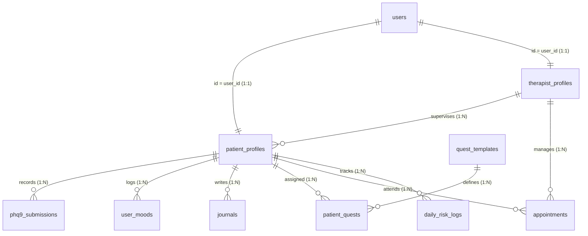
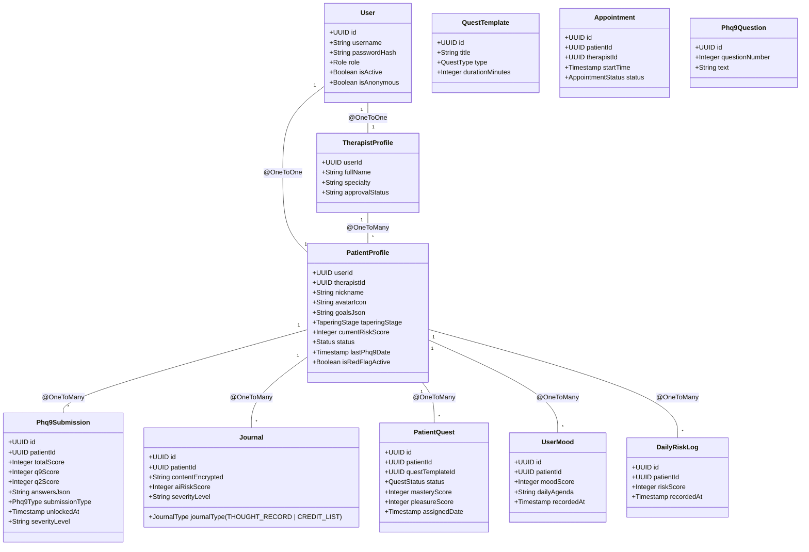

# Thiết kế Cơ sở Dữ liệu (Database Design)

Tài liệu này tổng hợp toàn bộ sơ đồ, đặc tả kỹ thuật và ý nghĩa y khoa (CBT) của cơ sở dữ liệu hệ thống Reconnect.

## 1. Sơ đồ ERD (Entity Relationship Diagram)

## 2. Sơ đồ Lớp (Class Diagram - Java Entity)

---

## 3. Đặc tả Chi tiết các Bảng và Quan hệ

### 3.1 Bảng `users`
- `id` (UUID, PK)
- `email` (String, Unique)
- `username` (String)
- `password_hash` (String, BCrypt)
- **`real_phone`** (String, Encrypted) -> Phục vụ cứu hộ khẩn cấp khi có Cờ Đỏ
- `role` (Enum: PATIENT | THERAPIST | ADMIN)
- `is_active` (Boolean)
- `is_anonymous` (Boolean)

### 3.2 Bảng `patient_profiles`
- `user_id` (UUID, PK, FK) -> Liên kết **1:1** với `users.id`
- **`therapist_id`** (UUID, FK) -> Liên kết **N:1** với `therapist_profiles.user_id` (Bác sĩ phụ trách)
- `nickname` (String)
- `avatar_icon` (String)
- `goals_json` (JSON string - Lưu 3-5 mục tiêu)
- `tapering_stage` (Enum: NONE, WEEKLY, MONTHLY, QUARTERLY)
- `current_risk_score` (Integer, 0-100)
- `status` (Enum: STABLE, WARNING, PROGRESSING)
- `last_phq9_date` (Timestamp)
- **`is_red_flag_active`** (Boolean, Default: false)

### 3.3 Bảng `therapist_profiles`
- `user_id` (UUID, PK, FK) -> Liên kết **1:1** với `users.id`
- `full_name` (String)
- `specialty` (String)
- `approval_status` (Enum: PENDING | ACTIVE | REJECTED)

### 3.4 Bảng `phq9_submissions`
- `id` (UUID, PK)
- **`patient_id`** (UUID, FK) -> Liên kết **N:1** với `patient_profiles.user_id`
- `total_score` (Integer, 0-27)
- `q9_score` (Integer)
- `q2_score` (Integer)
- `answers_json` (JSON string)
- `submission_type` (Enum: BASELINE, PERIODIC, TRIGGERED)
- `severity_level` (Enum: MINIMAL, MILD, MODERATE, MODERATELY_SEVERE, SEVERE)
- `unlocked_at` (Timestamp)

### 3.5 Bảng `user_moods`
- `id` (UUID, PK)
- **`patient_id`** (UUID, FK) -> Liên kết **N:1** với `patient_profiles.user_id`
- `mood_score` (Integer, 0-100)
- **`daily_agenda`** (String) -> Vấn đề cần giải quyết duy nhất trong ngày
- `recorded_at` (Timestamp)

### 3.6 Bảng `journals`
- `id` (UUID, PK)
- **`patient_id`** (UUID, FK) -> Liên kết **N:1** với `patient_profiles.user_id`
- **`journal_type`** (Enum: **THOUGHT_RECORD** | **CREDIT_LIST**)
- `content_encrypted` (Text)
- `ai_risk_score` (Integer: 0, 70, 100)
- `severity_level` (Enum: NORMAL, WARNING, DANGER)

### 3.7 Bảng `daily_risk_logs`
- `id` (UUID, PK)
- **`patient_id`** (UUID, FK) -> Liên kết **N:1** với `patient_profiles.user_id`
- `risk_score` (Integer, 0-100)
- `recorded_at` (Timestamp)

### 3.8 Bảng `quest_templates`
- `id` (UUID, PK)
- `title` (String)
- `content` (Text)
- `type` (Enum: COGNITIVE | BEHAVIORAL)
- `duration_minutes` (Integer)

### 3.9 Bảng `patient_quests`
- `id` (UUID, PK)
- **`patient_id`** (UUID, FK) -> Liên kết **N:1** với `patient_profiles.user_id`
- **`quest_template_id`** (UUID, FK) -> Liên kết **N:1** với `quest_templates.id`
- `status` (Enum: LOCKED, AVAILABLE, DONE)
- `mastery_score` (Integer, 0-10)
- `pleasure_score` (Integer, 0-10)
- `assigned_date` (Timestamp)

### 3.10 Bảng `appointments`
- `id` (UUID, PK)
- **`patient_id`** (UUID, FK) -> Liên kết **N:1** với `patient_profiles.user_id`
- **`therapist_id`** (UUID, FK) -> Liên kết **N:1** với `therapist_profiles.user_id`
- `start_time` (Timestamp)
- `status` (Enum: PENDING | CONFIRMED | CANCELLED | COMPLETED)
- `type` (Enum: BOOSTER | REGULAR | EMERGENCY)
- `meeting_link` (String)

### 3.11 Bảng `phq9_questions`
- `id` (UUID, PK) -> Kế thừa từ `BaseObject`
- `question_number` (Integer) -> Số thứ tự câu hỏi (1 đến 9)
- `text` (String) -> Nội dung câu hỏi tiếng Việt
- `create_date` (Timestamp)
- `created_by` (String)
- `modify_date` (Timestamp)
- `modified_by` (String)
- `voided` (Boolean)
- `is_active` (Boolean)
- `created_at` (Timestamp)

---

## 4. Ý nghĩa Lâm sàng & Kỹ thuật
- **Chiến lược Ẩn danh:** Lưu trữ `real_phone` mã hóa nhưng chỉ hiển thị `nickname` để bảo mật tối đa.
- **Chu kỳ 14 ngày:** Kết hợp giữa `last_phq9_date` và `assigned_date` để AI phân bổ đúng tỷ lệ 80/20 (Nặng) hoặc 50/50 (Nhẹ).
- **Lộ trình 3 Giai đoạn:** Hỗ trợ tốt nghiệp dựa trên 2 chu kỳ PHQ-9 liên tiếp < 5 điểm.
- **Bảo mật:** `content_encrypted` và tính ẩn danh được ưu tiên hàng đầu.
